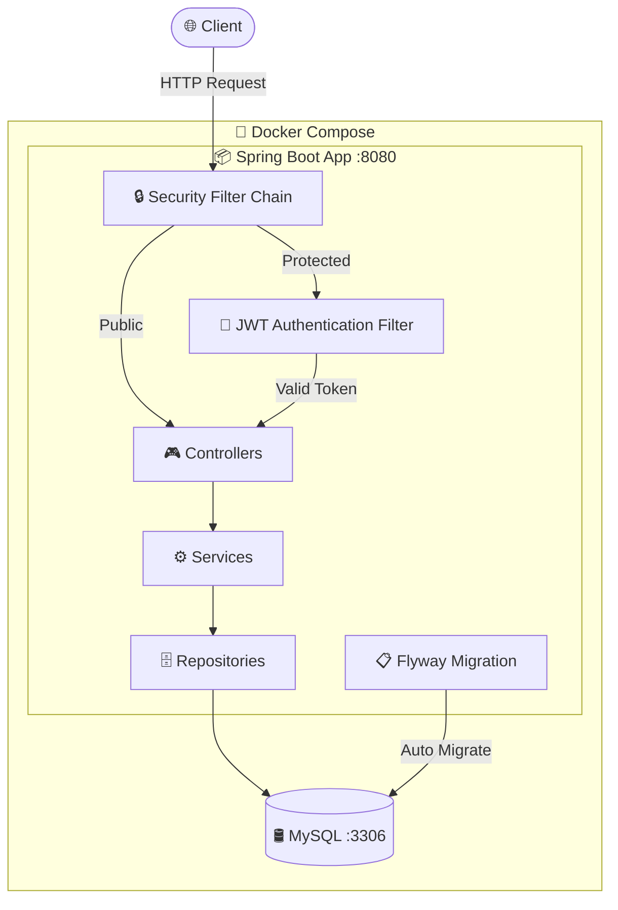
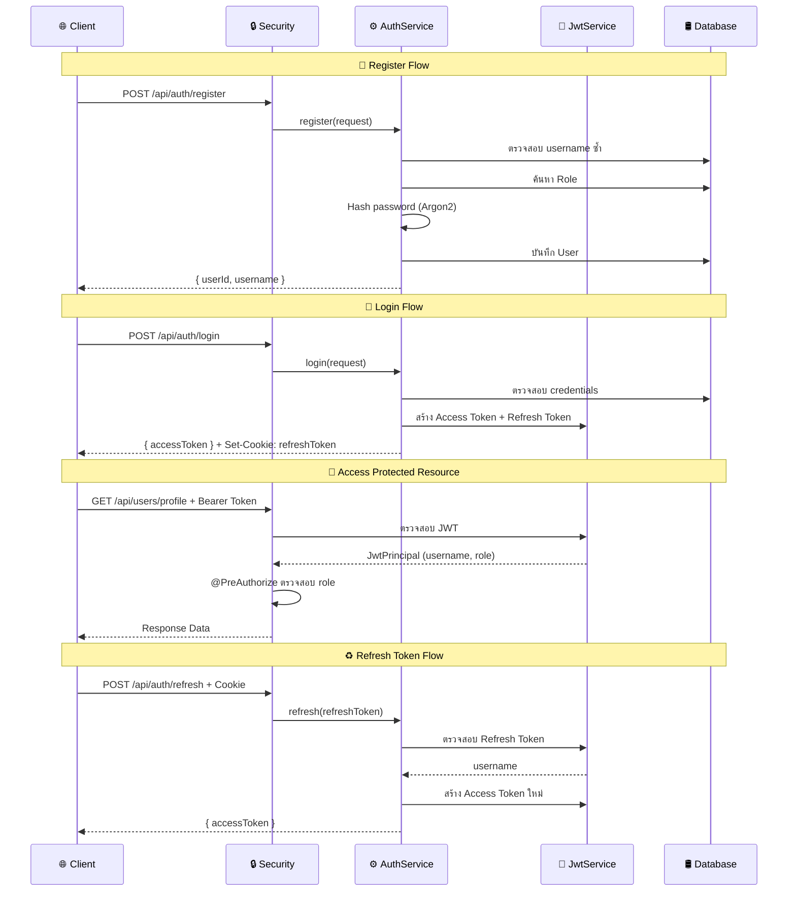

<div align="center">

# 🔐 RBAC Template — Spring Boot

**Base project สำหรับระบบ Authentication & Authorization แบบ Role-Based Access Control (RBAC)**

พร้อมใช้งาน JWT, Flyway Migration, Docker และ Spring Security


</div>

---

## 📑 สารบัญ

- [Quick Start](#-quick-start)
- [Prerequisites](#-prerequisites)
- [Tech Stack](#-tech-stack)
- [Architecture](#-architecture)
- [โครงสร้างโปรเจกต์](#-โครงสร้างโปรเจกต์)
- [การรันโปรเจกต์](#-การรันโปรเจกต์)
  - [รันด้วย Docker (แนะนำ)](#-รันด้วย-docker-แนะนำ)
  - [รันแบบ Local Development](#-รันแบบ-local-development)
- [Environment Variables](#-environment-variables)
- [Flow การทำงาน](#-flow-การทำงาน)
- [API Endpoints](#-api-endpoints)
- [Flyway — Database Migration](#-flyway--database-migration)
- [การจัดการ Role](#-การจัดการ-role)
- [Config ที่ต้องรู้](#-config-ที่ต้องรู้)
- [Testing](#-testing)
- [Security Best Practices](#-security-best-practices)
- [Troubleshooting](#-troubleshooting)
- [การนำไปใช้ต่อ](#-การนำไปใช้ต่อ)
- [What's Next — Roadmap](#-whats-next--roadmap)
- [Contributing](#-contributing)
- [License](#-license)
- [เครดิต](#-เครดิต)

---

## ⚡ Quick Start

สำหรับคนที่อยากรันทันที ไม่อยากอ่านยาว:

```bash
# 1. Clone โปรเจกต์
git clone https://github.com/pornput/RBAC-template.git
cd RBAC-template

# 2. รันทุกอย่างด้วย Docker
docker compose up -d --build

# 3. ทดสอบ health check
curl http://localhost:8080/api/public/ping
# → "pong"

# 4. สมัครสมาชิก
curl -s -X POST http://localhost:8080/api/auth/register \
  -H "Content-Type: application/json" \
  -d '{"username":"testuser","password":"12345678","confirmPassword":"12345678"}'

# 5. เข้าสู่ระบบ
curl -s -c cookies.txt -X POST http://localhost:8080/api/auth/login \
  -H "Content-Type: application/json" \
  -d '{"username":"testuser","password":"12345678"}'
```

> 💡 ดูตัวอย่าง request/response เพิ่มเติมที่ส่วน [API Endpoints](#-api-endpoints-พร้อมตัวอย่าง)

---

## 📋 Prerequisites

| ซอฟต์แวร์ | เวอร์ชันขั้นต่ำ | จำเป็น | หมายเหตุ |
|---|---|---|---|
| **Docker** + **Docker Compose** | 20.x+ / v2+ | ✅ | สำหรับรัน MySQL และ production |
| **Java JDK** | 21 | ⚠️ | ต้องการเมื่อรันแบบ local dev เท่านั้น |
| **Maven** | 3.9+ | ❌ | ไม่ต้องติดตั้ง — มี `mvnw` wrapper ให้แล้ว |

> ⚠️ **หมายเหตุ:** ถ้ารันด้วย Docker อย่างเดียว ไม่ต้องติดตั้ง Java หรือ Maven เลย

---

## 🛠️ Tech Stack

| เทคโนโลยี | เวอร์ชัน / รายละเอียด |
|---|---|
| Java | 21 |
| Spring Boot | 3.5.x |
| Spring Security | Method-level security + JWT stateless |
| Database | MySQL 8.0 |
| ORM | Spring Data JPA (Hibernate) |
| Migration | Flyway |
| JWT | Nimbus JOSE + JWT (HS256) |
| Password Hashing | Argon2 (via BouncyCastle) |
| Build Tool | Maven (with wrapper) |
| Container | Docker + Docker Compose |
| Mapper | MapStruct 1.6.x |
| Lombok | 1.18.x |
| Testing | Spock Framework 2.4 + Groovy 5.0 |

---

## 🏗️ Architecture

### ภาพรวมระบบ



### Authentication Flow



---

## 📁 โครงสร้างโปรเจกต์

```
src/main/java/com/pornput/rbactemplate/
├── config/                    # Config ต่างๆ
│   ├── CorsProperties         #   - CORS properties binding
│   ├── RoleConfig             #   - Role hierarchy
│   └── WebConfig              #   - CORS mapping
├── constant/                  # ค่าคงที่
│   ├── RbacConstant           #   - Role name constants
│   └── RoleType               #   - Role enum (single source of truth)
├── controllers/               # REST Controllers
│   ├── AuthController         #   - /api/auth/** (register, login, refresh)
│   ├── UserController         #   - /api/users/** (profile, dashboard)
│   └── PingController         #   - /api/public/** (health check)
├── entities/                  # JPA Entities
│   ├── User                   #   - ตาราง users
│   └── Role                   #   - ตาราง roles
├── exception/                 # Exception Handling
│   ├── GlobalExceptionController  # - จัดการ exception ทั้งระบบ
│   ├── ExceptionResponse          # - รูปแบบ error response
│   ├── BadRequestException        # - 400
│   └── UnauthorizedException      # - 401
├── jwt/                       # JWT Module
│   ├── JwtService             #   - interface สำหรับ JWT operations
│   ├── JwtConfig              #   - JWT configuration properties
│   ├── JwtClaims              #   - Decoded JWT claims model
│   ├── JwtPrincipal           #   - Authenticated user principal
│   ├── JwtException           #   - JWT-specific exception
│   └── implement/
│       └── JwtServiceImpl     #   - HMAC-SHA256 implementation
├── mapper/                    # MapStruct Mappers
│   └── UserMapper             #   - Entity ↔ DTO mapping
├── model/rbac/                # Request/Response DTOs
│   ├── CustomUserDetails      #   - UserDetails implementation
│   ├── request/
│   │   ├── LoginRequest       #   - { username, password }
│   │   └── RegisterRequest    #   - { username, password, confirmPassword }
│   └── response/
│       ├── AccessTokenResponse    # - { accessToken }
│       └── RegisterResponse       # - { userId, username }
├── repositories/              # Spring Data Repositories
│   ├── UserRepository
│   └── RoleRepository
├── security/                  # Security Configuration
│   ├── SecurityConfig         #   - Filter chain, password encoder
│   ├── JwtAuthenticationFilter    # - JWT extraction + validation filter
│   └── exception/
│       └── RestAuthenticationEntryPoint  # - 401 JSON response
└── services/                  # Business Logic
    ├── AuthService            #   - Register, Login, Refresh
    └── CustomUserDetailsService   # - Load user from DB

src/main/resources/
├── application.yml                # Config หลัก (profile: dev)
├── application-dev.yml            # Config สำหรับ local development
├── application-production.yml     # Config สำหรับ Docker/production
└── db/migration/                  # Flyway SQL migration files
    ├── V1__init_rbac.sql          #   - สร้างตาราง roles, users
    └── V2__seed_default_roles.sql #   - Insert role ADMIN, USER

src/test/groovy/                   # Tests (Spock Framework)
├── integration/controllers/
│   └── AuthControllerTest         #   - Integration test สำหรับ AuthController
└── unit/
    ├── controllers/
    │   ├── PingControllerTest     #   - Unit test PingController
    │   └── UserControllerTest     #   - Unit test UserController
    ├── jwt/
    │   └── JwtServiceTest         #   - Unit test JWT operations
    ├── security/
    │   └── JwtAuthenticationFilterTest  # - Unit test JWT filter
    └── services/
        ├── AuthServiceTest        #   - Unit test AuthService
        └── CustomUserDetailsServiceTest # - Unit test UserDetailsService
```

---

## 🚀 การรันโปรเจกต์

### 🐳 รันด้วย Docker (แนะนำ)

ใช้คำสั่งเดียวรัน MySQL + Application พร้อมกัน:

```bash
docker compose up -d --build
```

- **Application** → `http://localhost:8080`
- **MySQL** → `localhost:3300`
- **Flyway** จะ migrate database ให้อัตโนมัติตอน start

ตรวจสอบสถานะ:

```bash
# ดู logs ของ application
docker compose logs -f app

# ดู logs ของ database
docker compose logs -f db

# ดูสถานะ containers
docker compose ps
```

หยุดการทำงาน:

```bash
# หยุด containers
docker compose down

# หยุด + ลบ volume (ล้าง database ทั้งหมด)
docker compose down -v
```

### 💻 รันแบบ Local Development

**ขั้นตอนที่ 1 — รัน MySQL:**

```bash
docker compose up db -d
```

**ขั้นตอนที่ 2 — รัน Spring Boot:**

```bash
./mvnw spring-boot:run
```

Application จะใช้ profile `dev` (`application-dev.yml`) โดยอัตโนมัติ ต่อ MySQL ที่ `localhost:3300`

> 💡 **Tip:** ใช้ `spring-boot-devtools` สำหรับ Live Reload — เมื่อแก้ไขโค้ด application จะ restart อัตโนมัติ

---

## 🔧 Environment Variables

ตัวแปรด้านล่างจะถูกใช้เมื่อรันด้วย profile `production` (ใน Docker)  
ตั้งค่าได้ที่ `docker-compose.yml` หรือ system environment variables

### Database

| ตัวแปร | คำอธิบาย | ค่า Default |
|---|---|---|
| `DB_HOST` | Hostname ของ MySQL | `db` |
| `DB_PORT` | Port ของ MySQL | `3306` |
| `DB_NAME` | ชื่อ Database | `template_rbac_database` |
| `DB_USERNAME` | Username สำหรับต่อ DB | `root` |
| `DB_PASSWORD` | Password สำหรับต่อ DB | **ต้องกำหนด** |

### JWT

| ตัวแปร | คำอธิบาย | ค่า Default |
|---|---|---|
| `JWT_SECRET` | Secret key สำหรับ Access Token (≥ 32 chars) | **ต้องกำหนด** |
| `JWT_SECRET_REFRESH` | Secret key สำหรับ Refresh Token (≥ 32 chars) | **ต้องกำหนด** |
| `JWT_EXPIRATION` | อายุ Access Token (วินาที) | `3600` (1 ชม.) |
| `JWT_EXPIRATION_REFRESH` | อายุ Refresh Token (วินาที) | `604800` (7 วัน) |
| `JWT_ISSUER` | Issuer ใน JWT | `rbac-template` |

### CORS

| ตัวแปร | คำอธิบาย | ค่า Default |
|---|---|---|
| `CORS_ALLOWED_ORIGINS` | Origin ที่อนุญาต (คั่นด้วย `,`) | `http://localhost:5173,http://localhost:3000` |
| `CORS_ALLOWED_METHODS` | HTTP methods ที่อนุญาต | `GET,POST,PUT,DELETE,OPTIONS` |

> ⚠️ **สำคัญ:** สำหรับ production จริง **ต้องเปลี่ยน** `JWT_SECRET`, `JWT_SECRET_REFRESH` และ `DB_PASSWORD` เป็นค่าที่ปลอดภัย  
> Refresh Token Cookie ถูกตั้งค่า `Secure`, `HttpOnly`, `SameSite=Lax` แล้วโดย default

---

## 🔄 Flow การทำงาน

### Register

```
Client → POST /api/auth/register
         { "username", "password", "confirmPassword" }
       → AuthService.register()
         1. ตรวจสอบ username ซ้ำ
         2. กำหนด Role เป็น USER (self-registration)
         3. ค้นหา Role จาก database
         4. Hash password ด้วย Argon2
         5. บันทึก User ลง database
       → Response: { "userId", "username" }
```

### Login

```
Client → POST /api/auth/login
         { "username", "password" }
       → AuthenticationManager ตรวจสอบ credentials
       → สร้าง Access Token (JWT) + Refresh Token
       → Refresh Token ถูกเซ็ตเป็น HttpOnly Secure Cookie (SameSite=Lax)
       → Response: { "accessToken" }
```

### Refresh Token

```
Client → POST /api/auth/refresh
         (ต้องมี refreshToken cookie ติดมา)
       → ตรวจสอบ Refresh Token
       → สร้าง Access Token ใหม่
       → Response: { "accessToken" }
```

### การเข้าถึง Protected Endpoint

```
Client → GET /api/users/profile  (Header: Authorization: Bearer <accessToken>)
       → JwtAuthenticationFilter ดึง token จาก header
       → ตรวจสอบและ decode JWT
       → สร้าง JwtPrincipal + set SecurityContext
       → @PreAuthorize ตรวจสอบ role
       → เข้าถึง Controller ได้
```

---

## 📡 API Endpoints

| Method | Endpoint | Auth | Role | Description | Status Codes |
|---|---|---|---|---|---|
| `GET` | `/api/public/ping` | ❌ | - | Health check | `200` |
| `GET` | `/actuator/health` | ❌ | - | Spring Boot health status | `200` |
| `POST` | `/api/auth/register` | ❌ | - | สมัครสมาชิก (ได้ role USER) | `200`, `400` |
| `POST` | `/api/auth/login` | ❌ | - | เข้าสู่ระบบ | `200`, `401` |
| `POST` | `/api/auth/refresh` | Cookie | - | ต่ออายุ Access Token | `200`, `401` |
| `GET` | `/api/users/profile` | ✅ Bearer | USER+ | ดูข้อมูลผู้ใช้ | `200`, `401`, `403` |
| `GET` | `/api/users/dashboard` | ✅ Bearer | ADMIN | หน้า Admin dashboard | `200`, `401`, `403` |

> 💡 Protected endpoints ต้องส่ง header `Authorization: Bearer <accessToken>`  
> Access Token สร้างใหม่ได้ผ่าน `POST /api/auth/refresh` โดยใช้ refreshToken cookie

### Error Response Format

ทุก endpoint ใช้ error response format เดียวกัน:

```json
{
  "message": "Error message",
  "status": 400,
  "error": "Bad Request",
  "path": "/api/example",
  "timestamp": "2026-03-07T12:00:00Z",
  "validateError": [{ "field": "username", "message": "must not be blank", "code": "NotBlank" }]
}
```

> `validateError` จะปรากฏเฉพาะเมื่อ validation ไม่ผ่าน

---

### 🟢 Public Endpoints (ไม่ต้อง login)

#### `GET /api/public/ping` — Health Check

```bash
curl http://localhost:8080/api/public/ping
```

```
"pong"
```

---

#### `POST /api/auth/register` — สมัครสมาชิก

```bash
curl -s -X POST http://localhost:8080/api/auth/register \
  -H "Content-Type: application/json" \
  -d '{
    "username": "john",
    "password": "12345678",
    "confirmPassword": "12345678"
  }'
```

<details>
<summary>✅ สำเร็จ — 200 OK</summary>

```json
{
  "userId": 1,
  "username": "john"
}
```
</details>

<details>
<summary>❌ Username ซ้ำ — 400 Bad Request</summary>

```json
{
  "message": "Username already exists",
  "status": 400,
  "error": "Bad Request",
  "path": "/api/auth/register",
  "timestamp": "2025-03-07T12:00:00Z"
}
```
</details>

<details>
<summary>❌ Validation ไม่ผ่าน — 400 Bad Request</summary>

```json
{
  "message": "Validation Failed",
  "status": 400,
  "error": "Bad Request",
  "path": "/api/auth/register",
  "validateError": [
    { "field": "username", "message": "must not be blank", "code": "NotBlank" },
    { "field": "password", "message": "size must be between 8 and 16", "code": "Size" }
  ],
  "timestamp": "2025-03-07T12:00:00Z"
}
```
</details>

> 💡 Self-registration จะได้ role `USER` เสมอ — การกำหนด role อื่นต้องทำผ่าน admin endpoint

---

#### `POST /api/auth/login` — เข้าสู่ระบบ

```bash
curl -s -c cookies.txt -X POST http://localhost:8080/api/auth/login \
  -H "Content-Type: application/json" \
  -d '{
    "username": "john",
    "password": "12345678"
  }'
```

<details>
<summary>✅ สำเร็จ — 200 OK</summary>

```json
{
  "accessToken": "eyJhbGciOiJIUzI1NiJ9.eyJzdWIiOiJqb2huIiwi..."
}
```

> Response จะมี `Set-Cookie: refreshToken=...; HttpOnly; Secure; SameSite=Lax; Path=/` ด้วย
</details>

<details>
<summary>❌ credentials ไม่ถูกต้อง — 401 Unauthorized</summary>

```json
{
  "message": "Invalid username or password",
  "status": 401,
  "error": "Unauthorized",
  "path": "/api/auth/login",
  "timestamp": "2025-03-07T12:00:00Z"
}
```
</details>

---

#### `POST /api/auth/refresh` — ต่ออายุ Token

```bash
curl -s -b cookies.txt -X POST http://localhost:8080/api/auth/refresh
```

<details>
<summary>✅ สำเร็จ — 200 OK</summary>

```json
{
  "accessToken": "eyJhbGciOiJIUzI1NiJ9.eyJzdWIiOiJqb2huIiwi..."
}
```
</details>

<details>
<summary>❌ Refresh Token ไม่ถูกต้อง / หมดอายุ — 401 Unauthorized</summary>

```json
{
  "message": "Invalid refresh token",
  "status": 401,
  "error": "Unauthorized",
  "path": "/api/auth/refresh",
  "timestamp": "2025-03-07T12:00:00Z"
}
```
</details>

---

### 🔒 Protected Endpoints (ต้อง login + ส่ง Bearer Token)

#### `GET /api/users/profile` — ดูข้อมูลตัวเอง (ต้องมี role `USER` ขึ้นไป)

```bash
curl -s http://localhost:8080/api/users/profile \
  -H "Authorization: Bearer <ACCESS_TOKEN>"
```

<details>
<summary>✅ สำเร็จ — 200 OK</summary>

```
"Hello john"
```
</details>

<details>
<summary>❌ ไม่มี Token / Token หมดอายุ — 401 Unauthorized</summary>

```json
{
  "message": "Invalid username or password",
  "status": 401,
  "error": "Unauthorized",
  "path": "/api/users/profile",
  "timestamp": "2025-03-07T12:00:00Z"
}
```
</details>

---

#### `GET /api/users/dashboard` — หน้า Admin (ต้องมี role `ADMIN`)

```bash
curl -s http://localhost:8080/api/users/dashboard \
  -H "Authorization: Bearer <ADMIN_ACCESS_TOKEN>"
```

<details>
<summary>✅ สำเร็จ — 200 OK</summary>

```
"Admin dashboard"
```
</details>

---

## 📋 Flyway — Database Migration

โปรเจกต์นี้ใช้ **Flyway** จัดการ database schema:

- **ไม่ใช้** Hibernate `ddl-auto` (ตั้งค่าเป็น `none`)
- ทุกการเปลี่ยนแปลง schema ต้องเขียนเป็นไฟล์ SQL migration

### ไฟล์ Migration อยู่ที่

```
src/main/resources/db/migration/
```

### Migration ที่มีอยู่

| ไฟล์ | คำอธิบาย |
|---|---|
| `V1__init_rbac.sql` | สร้างตาราง `roles` และ `users` |
| `V2__seed_default_roles.sql` | Insert role `ADMIN` และ `USER` |

### การตั้งชื่อไฟล์

```
V{version}__{description}.sql
```

| ส่วน | คำอธิบาย | ตัวอย่าง |
|---|---|---|
| `V` | Prefix (บังคับ) | `V` |
| `{version}` | ตัวเลขลำดับ | `1`, `2`, `3` |
| `__` | Separator — ขีดล่าง **2** ตัว (บังคับ) | `__` |
| `{description}` | คำอธิบายสั้นๆ | `add_moderator_role` |

ตัวอย่าง:
```
V3__add_moderator_role.sql
V4__add_email_to_users.sql
V5__create_permissions_table.sql
```

### กฎสำคัญ

> ⚠️ **ห้ามแก้ไข** ไฟล์ migration ที่รันไปแล้ว — Flyway จะ checksum ตรวจสอบ ถ้าไม่ตรงจะ error ตอน start

> 💡 **Tip:** ถ้าต้องการแก้ schema ให้สร้างไฟล์ migration **ใหม่** เสมอ (เช่น `ALTER TABLE`)

> 💡 **Tip:** Flyway รัน migration อัตโนมัติตอน application start — ไม่ต้องรันเอง

---

## 🎭 การจัดการ Role

ระบบจัดการ role ผ่าน `RoleType` enum เป็น **single source of truth**  
คนที่นำ template ไปใช้ แค่แก้ enum ก็พอ

### เพิ่ม Role ใหม่

สมมติต้องการเพิ่ม role `MODERATOR`:

**ขั้นตอนที่ 1 — เพิ่มใน enum `RoleType`**

```java
// src/main/java/.../constant/RoleType.java
public enum RoleType {
    ADMIN,
    USER,
    MODERATOR;  // ← เพิ่มตรงนี้

    public static final RoleType DEFAULT = USER;
    // ...
}
```

**ขั้นตอนที่ 2 — สร้าง Flyway migration**

สร้างไฟล์ `V3__add_moderator_role.sql`:

```sql
INSERT INTO roles (name) VALUES ('MODERATOR');
```

**ขั้นตอนที่ 3 — อัพเดท Role Hierarchy (ถ้าต้องการ)**

```java
// src/main/java/.../config/RoleConfig.java
return RoleHierarchyImpl.fromHierarchy("""
    ROLE_ADMIN > ROLE_MODERATOR
    ROLE_MODERATOR > ROLE_USER
    ROLE_USER > ROLE_ANONYMOUS
""");
```

**ขั้นตอนที่ 4 — ใช้งานใน Controller**

```java
@PreAuthorize("hasRole('MODERATOR')")
@GetMapping("/moderate")
public String moderatePage() { ... }
```

### ลบ Role

1. ลบ enum value ออกจาก `RoleType`
2. สร้าง Flyway migration สำหรับลบ role จาก database (ระวัง foreign key กับ users)
3. อัพเดท `RoleConfig` hierarchy
4. ลบ `@PreAuthorize` ที่อ้างถึง role นั้นออก

> ⚠️ **ระวัง:** ก่อนลบ role ต้อง migrate user ที่ใช้ role นั้นไป role อื่นก่อน เพราะมี foreign key constraint

---

## ⚙️ Config ที่ต้องรู้

### Security Config

**ไฟล์:** `security/SecurityConfig.java`

- กำหนด endpoint ที่เป็น public (ไม่ต้อง login):
  - `/api/auth/**` — register, login, refresh
  - `/api/public/**` — ping/health check
  - `/actuator/health` — health check (Actuator)
  - `/health`, `/error`
- endpoint **อื่นทั้งหมด** ต้อง authenticated
- ใช้ **Stateless session** (ไม่มี server-side session)
- Password hashing ใช้ **Argon2**

เมื่อต้องการเพิ่ม public endpoint:

```java
.requestMatchers(
    "/api/auth/**",
    "/api/public/**",
    "/api/new-public/**",  // ← เพิ่มตรงนี้
    "/health",
    "/error").permitAll()
```

### CORS Config

**ไฟล์:** `config/WebConfig.java` + `config/CorsProperties.java`

ตั้งค่าผ่าน application config:

```yaml
cors:
  allowed-origins:
    - http://localhost:5173
    - http://localhost:3000
  allowed-methods: GET,POST,PUT,DELETE,OPTIONS
  allow-credentials: true
  max-age: 3600
```

สำหรับ production ตั้งค่าผ่าน env `CORS_ALLOWED_ORIGINS`

### JWT Config

**ไฟล์:** `jwt/JwtConfig.java`

| ค่า | คำอธิบาย | ตัวอย่าง |
|---|---|---|
| `secret` | Key สำหรับ sign Access Token (≥ 32 chars) | `my-super-secret-...` |
| `secretRefresh` | Key สำหรับ sign Refresh Token (≥ 32 chars) | `my-refresh-secret-...` |
| `expiration` | อายุ Access Token (วินาที) | `3600` |
| `expirationRefresh` | อายุ Refresh Token (วินาที) | `604800` |
| `issuer` | ชื่อ issuer ที่ใส่ใน JWT | `rbac-template` |

> ⚠️ **JWT Secret ต้องยาวอย่างน้อย 32 ตัวอักษร** (256 bits) เพราะใช้ HMAC-SHA256 — ถ้าสั้นกว่านี้จะ error ตอนสร้าง token

### Role Hierarchy

**ไฟล์:** `config/RoleConfig.java`

ค่าเริ่มต้น:
```
ROLE_ADMIN > ROLE_USER > ROLE_ANONYMOUS
```

หมายความว่า `ADMIN` สามารถเข้าถึง endpoint ที่กำหนดให้ `USER` ได้ด้วย  
(ระบบ hierarchy จะ inherit permission ลงมา)

---

## 🧪 Testing

โปรเจกต์ใช้ **Spock Framework** (Groovy) สำหรับเขียน tests

### รัน Tests ทั้งหมด

```bash
./mvnw test
```

### รัน Test เฉพาะ class

```bash
./mvnw test -Dtest="AuthServiceTest"
```

### โครงสร้าง Tests

| ประเภท | ไฟล์ | ครอบคลุม |
|---|---|---|
| **Unit Test** | `AuthServiceTest` | Register, Login, Refresh logic |
| **Unit Test** | `CustomUserDetailsServiceTest` | Load user, exception handling |
| **Unit Test** | `JwtServiceTest` | Generate/verify tokens, error cases |
| **Unit Test** | `JwtAuthenticationFilterTest` | Filter chain behavior |
| **Unit Test** | `PingControllerTest` | Ping endpoint |
| **Unit Test** | `UserControllerTest` | Profile, Dashboard |
| **Integration Test** | `AuthControllerTest` | Full MVC test with MockMvc |

### Test Naming Convention

```groovy
def "register should throw BadRequestException when username already exists"() {
    // ...
}
```

รูปแบบ: `<method> should <expected behavior> when <condition>`

> 💡 **Tip:** เมื่อเพิ่ม feature ใหม่ ควรเขียน test ด้วยเสมอ — ดูไฟล์ที่มีอยู่เป็นตัวอย่าง

---

## 🛡️ Security Best Practices

### สำหรับ Production ต้องทำ

| # | สิ่งที่ต้องทำ | ไฟล์ที่เกี่ยวข้อง |
|---|---|---|
| 1 | เปลี่ยน `JWT_SECRET` เป็นค่า random ≥ 32 chars | `docker-compose.yml` / env |
| 2 | เปลี่ยน `JWT_SECRET_REFRESH` เป็นค่า random ≥ 32 chars | `docker-compose.yml` / env |
| 3 | เปลี่ยน `DB_PASSWORD` เป็นค่าที่ปลอดภัย | `docker-compose.yml` / env |
| 4 | ตั้ง `CORS_ALLOWED_ORIGINS` เป็นโดเมนจริงเท่านั้น | `docker-compose.yml` / env |
| 5 | ใช้ HTTPS ตลอด | Reverse proxy (Nginx, etc.) |
| 6 | ลด `JWT_EXPIRATION` ให้สั้นที่สุดที่รับได้ | env |
| 7 | จำกัด logging level เป็น `WARN` หรือ `INFO` | `application-production.yml` |

### Generate Secret Key

```bash
# สร้าง random secret key 64 chars
openssl rand -base64 48
```

### สิ่งที่ Template ดูแลให้แล้ว

- ✅ Password hashing ด้วย **Argon2** (state-of-the-art)
- ✅ **Stateless JWT** — ไม่เก็บ session บน server
- ✅ **HttpOnly Secure Cookie** สำหรับ refresh token (Secure + SameSite=Lax ป้องกัน XSS/CSRF)
- ✅ **CSRF disabled** (เหมาะกับ stateless API)
- ✅ **Self-registration ปลอดภัย** — ผู้ใช้ได้ role USER เท่านั้น
- ✅ **Role hierarchy** — จำกัดสิทธิ์ตามลำดับชั้น
- ✅ **Global exception handler** — รองรับ 400, 401, 403, 500 ไม่ leak stack trace
- ✅ **Input validation** — ด้วย Jakarta Bean Validation + null-safe
- ✅ **Method-level security** — `@PreAuthorize` บน Controller

---

## 🔍 Troubleshooting

<details>
<summary><strong>❌ Connection refused — ต่อ MySQL ไม่ได้</strong></summary>

**อาการ:** `com.mysql.cj.jdbc.exceptions.CommunicationsException: Communications link failure`

**สาเหตุ:** MySQL ยังไม่พร้อม หรือ port ไม่ตรง

**วิธีแก้:**

```bash
# ตรวจสอบว่า MySQL container รันอยู่
docker compose ps

# ดู logs ของ MySQL
docker compose logs db

# รอจนกว่า MySQL จะ healthy
docker compose up db -d
docker compose exec db mysqladmin ping -h localhost -u root -prootPassword
```

ถ้ารันแบบ local dev ตรวจสอบว่า port ตรงกัน (`3300` ใน `application-dev.yml`)
</details>

<details>
<summary><strong>❌ Flyway migration failed — checksum mismatch</strong></summary>

**อาการ:** `FlywayValidateException: Validate failed: Migration checksum mismatch`

**สาเหตุ:** แก้ไขไฟล์ migration ที่รันไปแล้ว

**วิธีแก้:**

```bash
# วิธีที่ 1: ล้าง database แล้วรันใหม่ (ง่ายสุดตอน dev)
docker compose down -v
docker compose up -d --build

# วิธีที่ 2: Repair Flyway (ใช้เมื่อ data สำคัญ)
./mvnw flyway:repair
```

> ⚠️ **กฎเหล็ก:** ห้ามแก้ไขไฟล์ migration ที่รันไปแล้ว — สร้างไฟล์ใหม่แทนเสมอ
</details>

<details>
<summary><strong>❌ JWT secret key too short</strong></summary>

**อาการ:** `JwtException: Failed to generate JWT` หรือ `KeyLengthException`

**สาเหตุ:** JWT secret สั้นกว่า 32 ตัวอักษร (256 bits)

**วิธีแก้:**

ใช้ secret key ที่ยาวอย่างน้อย 32 ตัวอักษร:

```bash
# สร้าง secret key ใหม่
openssl rand -base64 48
```

แล้วอัพเดทใน `docker-compose.yml` หรือ `application-dev.yml`
</details>

<details>
<summary><strong>❌ Port 3300 already in use</strong></summary>

**อาการ:** `Bind for 0.0.0.0:3300 failed: port is already allocated`

**วิธีแก้:**

```bash
# ดูว่าอะไรใช้ port อยู่
lsof -i :3300

# หยุด container เก่า
docker compose down

# หรือเปลี่ยน port ใน docker-compose.yml
# ports: "3301:3306"  (แล้วแก้ application-dev.yml ด้วย)
```
</details>

<details>
<summary><strong>❌ 401 Unauthorized ทุก request</strong></summary>

**Checklist:**
1. ตรวจสอบว่า URL ถูกต้อง — public endpoints ต้องขึ้นต้นด้วย `/api/auth/` หรือ `/api/public/`
2. สำหรับ protected endpoints ต้องส่ง header: `Authorization: Bearer <token>`
3. ตรวจสอบว่า token ยังไม่หมดอายุ
4. ตรวจสอบว่า role ตรงกับ `@PreAuthorize` ที่กำหนด
</details>

<details>
<summary><strong>❌ ./mvnw: Permission denied</strong></summary>

```bash
chmod +x mvnw
```
</details>

---

## 📦 การนำไปใช้ต่อ

### Checklist

- [ ] Clone หรือ Fork โปรเจกต์นี้
- [ ] เปลี่ยน package name จาก `com.pornput.rbactemplate` เป็นชื่อโปรเจกต์ของคุณ
- [ ] แก้ไข `groupId` และ `artifactId` ใน `pom.xml`
- [ ] แก้ไข `RoleType` enum — เพิ่ม/ลบ role ตามความต้องการ
- [ ] สร้าง Flyway migration สำหรับ role ใหม่ที่เพิ่ม
- [ ] อัพเดท `RoleConfig` สำหรับ role hierarchy ใหม่
- [ ] เพิ่ม Entity, Repository, Service, Controller ตาม business logic
- [ ] ตั้งค่า environment variables สำหรับ production
- [ ] เขียน unit tests สำหรับ logic ใหม่

### สิ่งที่ Template มีให้แล้ว

✅ Authentication (Register / Login / Refresh)  
✅ Authorization (Role-Based Access Control)  
✅ JWT (Access Token + Refresh Token)  
✅ Flyway Database Migration  
✅ Docker + Docker Compose  
✅ CORS Configuration  
✅ Global Exception Handler  
✅ Argon2 Password Hashing  
✅ Input Validation  
✅ Actuator Health Endpoint  
✅ Role Hierarchy  
✅ Unit + Integration Tests (Spock)  
✅ MapStruct DTO Mapping  

### สิ่งที่ต้องเพิ่มเอง

- Business logic เฉพาะโปรเจกต์
- Entity และ API endpoints ใหม่
- Tests สำหรับ logic ใหม่
- Frontend integration
- CI/CD pipeline

---

## 🗺️ What's Next — Roadmap

### วางแผนไว้

- [ ] เพิ่มระบบ Permission-based access control (นอกเหนือจาก Role)
- [ ] เพิ่ม Token blacklist / Token revocation
- [ ] รองรับ OAuth2 / Social login
- [ ] เพิ่ม Rate limiting
- [ ] เพิ่ม Audit logging
- [ ] Swagger / OpenAPI documentation
- [ ] CI/CD pipeline (GitHub Actions)
- [ ] Kubernetes deployment manifests

### Known Limitations

| ข้อจำกัด | รายละเอียด |
|---|---|
| Single role per user | ผู้ใช้ 1 คนมีได้ 1 role (ออกแบบไว้เป็น `@ManyToOne`) |
| No token revocation | ยังไม่มีระบบ blacklist token — ต้องรอ token หมดอายุ |
| No email verification | ยังไม่มีระบบยืนยัน email |
| No password reset | ยังไม่มีระบบ forgot password |

### Performance Considerations

- **Argon2** hashing ใช้เวลามากกว่า bcrypt — เหมาะกับ security แต่อาจช้าถ้ามี concurrent registration สูง
- **JWT verify** เป็น stateless ไม่ต้อง query database — เร็วกว่า session-based
- **Flyway** รันครั้งเดียวตอน startup — ไม่กระทบ runtime performance
- **HikariCP** connection pool ถูก configure ใน production profile แล้ว

### Deployment Guides

<details>
<summary><strong>🐳 Docker Compose (ค่าเริ่มต้น)</strong></summary>

ใช้ได้เลยตาม Quick Start ด้านบน — เหมาะกับ single server
</details>

<details>
<summary><strong>☁️ Cloud Deployment (แนวทาง)</strong></summary>

1. ใช้ managed database (เช่น AWS RDS, Cloud SQL) แทน MySQL container
2. Build Docker image แล้ว push ไป Container Registry
3. Deploy ด้วย Cloud Run, ECS, หรือ App Service
4. ตั้ง environment variables ผ่าน cloud provider
5. ใช้ Secret Manager แทนการใส่ secret ใน docker-compose

```bash
# Build image
docker build -t rbac-template:latest .

# Tag + Push
docker tag rbac-template:latest <registry>/rbac-template:latest
docker push <registry>/rbac-template:latest
```
</details>

---

## 🤝 Contributing

ยินดีรับ contribution! ถ้าต้องการมีส่วนร่วม:

1. **Fork** โปรเจกต์
2. สร้าง **feature branch** (`git checkout -b feature/amazing-feature`)
3. **Commit** changes (`git commit -m 'Add some amazing feature'`)
4. **Push** to branch (`git push origin feature/amazing-feature`)
5. เปิด **Pull Request**

### Guidelines

- เขียน unit test สำหรับทุก feature ใหม่
- ใช้ naming convention ตามที่มีอยู่ในโปรเจกต์
- ตรวจสอบว่า `./mvnw test` ผ่านทั้งหมดก่อน submit PR
- อธิบายการเปลี่ยนแปลงใน PR description

---

## 📄 License

โปรเจกต์นี้อยู่ภายใต้ **MIT License** — ดูรายละเอียดได้ที่ไฟล์ [LICENSE](LICENSE)

สามารถนำไปใช้ แก้ไข และเผยแพร่ได้อย่างอิสระ ทั้งโปรเจกต์ส่วนตัวและเชิงพาณิชย์

---

## 👤 เครดิต

### ผู้พัฒนา

**Pornput Sooduppatham**

[](https://github.com/pornput)

### เวอร์ชัน

| | |
|---|---|
| **Version** | `0.0.1-SNAPSHOT` |
| **Release Date** | มีนาคม 2569 (2026) |
| **Java** | 21 |
| **Spring Boot** | 3.5.x |

### Acknowledgments

เทคโนโลยีและ Libraries ที่ใช้:

- [Spring Boot](https://spring.io/projects/spring-boot) — Application framework
- [Spring Security](https://spring.io/projects/spring-security) — Security framework
- [Nimbus JOSE + JWT](https://connect2id.com/products/nimbus-jose-jwt) — JWT implementation
- [Flyway](https://flywaydb.org/) — Database migration
- [MapStruct](https://mapstruct.org/) — Object mapping
- [Lombok](https://projectlombok.org/) — Boilerplate reduction
- [Spock Framework](https://spockframework.org/) — Testing framework
- [BouncyCastle](https://www.bouncycastle.org/) — Argon2 password hashing

---

<div align="center">

**⭐ ถ้าโปรเจกต์นี้มีประโยชน์ อย่าลืมกด Star ให้ด้วยนะครับ! ⭐**

</div>
